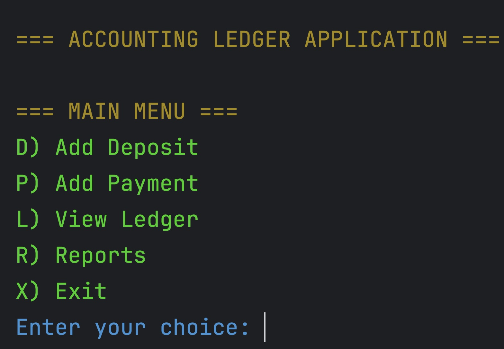
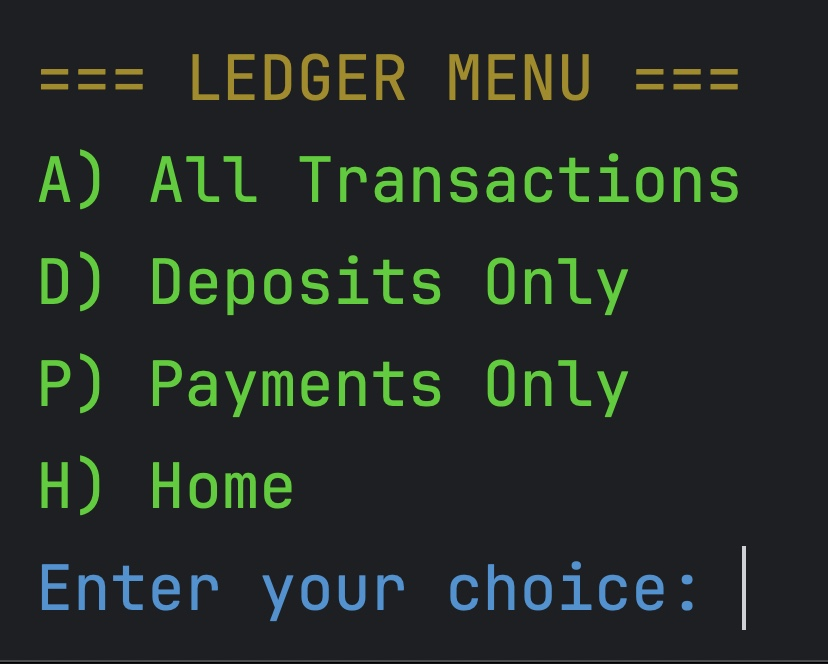
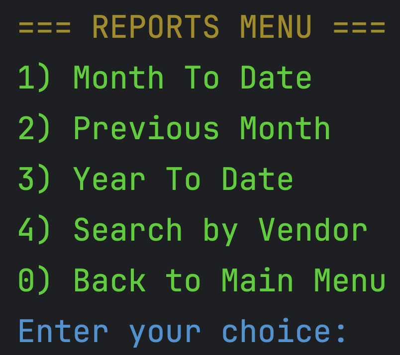

# Accounting Ledger Application

A command-line accounting system for tracking financial transactions with CSV persistence.

## Features

- 💰 **Transaction Management**
    - Record deposits and payments
    - Automatic date/time tracking
    - Vendor and description fields

- 📊 **Ledger Views**
    - All transactions (newest first)
    - Filter by deposits only
    - Filter by payments only

- 📈 **Financial Reports**
    - Month-to-date
    - Previous month 
    - Year-to-date
    - Vendor search

- 💾 **Data Persistence**
    - All data saved to `transactions.csv`
    - Automatic file creation
    - Data validation on load

### Home Screen

### Ledger Screen

### Report Screen

### Intersting Piece of Code

